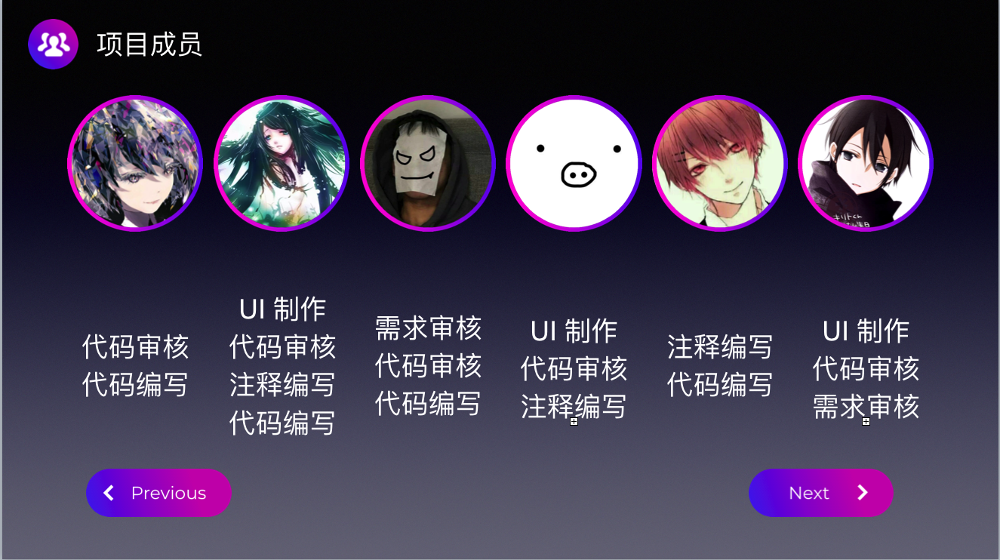

# QChat
An Online Chat Based On UDP&WebSockets Powered By QT
## Feature
Basic Feature of IM

Designed UI

LAN Scan & Find

Database on Server Support(Pymongo)

Web Chat (Based on WebSockets Server)

## Screenshots

(Most of the credit for our impressive UI must go to [Yupotian](https://github.com/yupotian))

## Something You NEED To Know…..
1. 本项目为UPC 小学期结课作业，所以可能部分功能并没有实际用途，欢迎二次修改。

2. 严格禁止将本项目或部分功能直接用于（包括但不限于）作业，评比等用途。

3. 本项目的账户功能基于服务器端数据库，因此你需要先行部署服务端并修改服务端IP才能实现注册登录，也欢迎将其修改为基于本地文件版本，将对应位置代码注释取消即可。

4. 服务端(/server)基于Python上Flask框架,Flask-Sockets及Pymongo插件，请确认安装了依赖及MongoDB。

5. 欢迎Issue及Pull Request。
## 感谢全体小组同学及@AndyLiu

